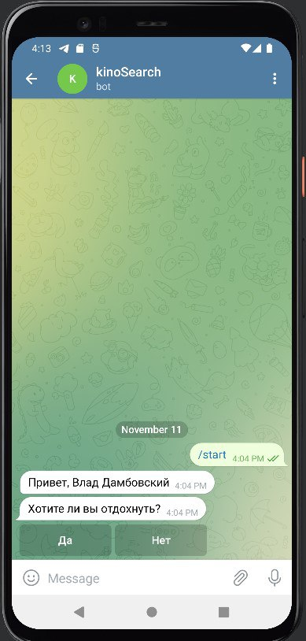

# TRITPO_lab_2
# ТРЕБОВАНИЯ К ПРОЕКТУ

### Содержание:
1. [Введение](#1)  
 1.1. [Назначение](#1.1)  
 1.2. [Бизнес-требования](#1.2)  
   1.2.1. [Исходные данные](#1.2.1)  
   1.2.2. [Возможности бизнеса](#1.2.2)  
   1.2.3. [Границы проекта](#1.2.3)  
 1.3 [Аналоги](#1.3)  
2. [Требования пользователя](#2)  
2.1. [Программные интерфейсы](#2.1)  
2.2. [Интерфейс пользователя](#2.2)  
2.3. [Характеристики пользователей](#2.3)  
2.3.1.[Классификация пользователей](#2.3.1)  
2.3.2[Целевая аудитория](#2.3.2)  
2.4. [Предположения и зависимости](#2.4)  
3. [Системные требования](#3)  
3.1. [Функциональные требования](#3.1)  
3.1.1. [Выбор способа проведения досуга](#3.1.1)  
3.1.2 [Оценка фильма](#3.1.2)  
3.1.3. [Выбор предостовляемых курсов](#3.1.3)  
3.1.4. [Уровень сложности курса](#3.1.4)  
3.2. [Нефункциональные требования](#3.2)  
3.2.1. [Визуальный стиль](#3.2.1)  
3.2.2. [Требования к удобству](#3.2.2)  
3.2.3.[Ограничения](#3.2.3) 

### 1. Введение 
#### 1.1 Назначение 
Этот документ является основным источником с требованиями к боту «KinoProga-бот» для Telegram.

#### 1.2 Бизнес-требования 
##### 1.2.1 Исходные данные 
Наше время, век глобальной компьютеризации и информатизации, предоставляет современному человеку невиданные ранее средства усиления его умственных возможностей, средства, позволяющие к тому же сделать интенсивными процессы интеллектуального развития. Так, использование возможностей средств современных информационных технологий позволяет приобретать знания, релаксировать и создавать нечто уникальное, не выходя из зоны комфорта, в чем помогает техника и программное обеспечение. Создание телеграмм-бота KinoProga выступает идейным генератором для просмотра фильмов и изучения программирования с помощью бесплатных специальных курсов. Уникальная возможность после прекрасного отдыха провести время с пользой, проработав свои навыки. 

##### 1.2.2. Возможности бизнеса 
Многие люди желают иметь сервис, который предоставляет возможность проведения досуга с пользой в удобной и легкодоступной форме. Именно представленный проект по созданию телеграмм-бота поможет решить сразу две проблемы: выбор фильма и изучения специальных курсов программирования совершенно бесплатно. 

##### 1.2.3. Границы проекта 
Приложение «KinoProga-бот» позволит пользователям совмещать приятное с полезным: просматривать увлекательные фильмы и практиковаться в программировании.

#### 1.3 Аналоги 
??

### 2. Требования пользователя 
#### 2.1. Программные интерфейсы 
Приложение должно работать в Telegram клиенте версии не ниже 6.0.0. В приложении должен использоваться Telegram Bot API версии 6.2. Должно быть написано на языка Python 3.10 и данных храниться в базе данных SQLite версии 3.39.4.

#### 2.2. Интерфейс пользователя 
При запуске должен отражаться диалог приветствия.
После диалога приветствия должен отражаться диалог первичной настройки.

Так должен выглядеть диалог при желании посмотреть фильм.

А так выглядит диалог для выбора изучаемого курса программирования.

#### 2.3. Характеристики пользователей 
### 2.3.1 Классификация пользователей 
Пользователи,которые установили данное приложение будут иметь доступ к полному функционалу программы.
### 2.3.2 Целевая аудитория 
Приложение предназначено для всех групп пользователей, которым интересен просмотр фильмов и/или изучения программирования.

#### 2.4. Предположения и зависимости 
1. Приложение не работает при отсутствии подключения к Интернету.
2. Приложение не работает при отсутствии Telegram.

### 3. Системные требования 
 Процессор с тактовой частотой 800 MHz или более мощный.Оперативная память 128 MB. Свободное место на жёстком диске от 49 Мб.

#### 3.1. Функциональные требования 
Пользователю предоставлены возможности, представленные ниже.

##### 3.1.1. Выбор способа проведения досуга.
Приложение должно предоставить выбор между предостовляемыми услугами.
##### 3.1.2. Оценка фильма.
Приложение должно предоставить возможность оценки просмотренного фильма.
##### 3.1.3. Выбор предостовляемых курсов.
Приложение должно предоставить список тем курсов для обучения.
##### 3.1.4. Уровень сложности курса.
Приложение должно предоставить выбор уровня сложности курса в зависимости от опыта пользователя.

#### 3.2. Нефункциональные требования 
##### 3.2.1. Визуальный стиль 
Визуальный стиль приложения должен быть выполнен в нейтральных цветах в меню выбора марки автомобиля,и менять свой цвет под фирменный цвет марки при переходе в дальнейшие меню.
##### 3.2.2. Требования к удобству 
Должна быть легкость использования засчет минималистичного интерфейса, удобство в использовании пользователями любого уровня технической грамотности. Должна быть обратная связь с пользователем.

 ##### 3.2.3. Ограничения 
1. Приложение работает только при наличии подключения к Интернету.
2. Приложение не работает при отсутствии Telegram.
3.Язык приложения русский.
